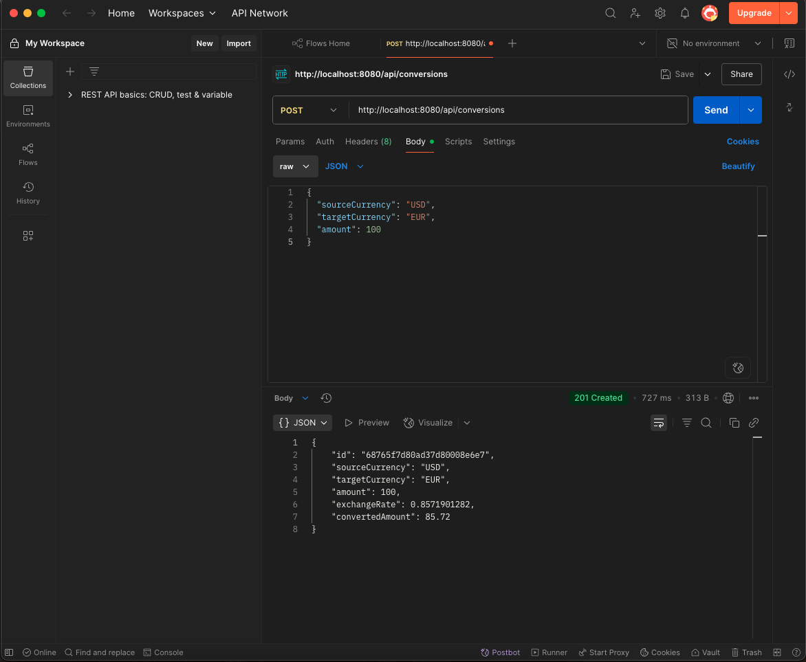

# CurrencyConverter

## DEMO

## Architectural Deep Dive
This application is built using a layered, Clean Architecture. This isn't just a suggestion; it's a professional standard that ensures the system is maintainable, scalable, and testable.

Controller Layer (@RestController): This is the API Gateway or the "front door." Its sole responsibility is to handle HTTP protocol concerns. It validates incoming requests (@Valid) to enforce the API contract, deserializes JSON into DTOs (@RequestBody), and delegates all real work to the service layer. It knows nothing about business logic or databases.

Service Layer (@Service): This is the business logic core. It's the brain of the microservice. It orchestrates the workflow:

It receives a request from the controller.

It calls the CurrencyApiClient to fetch external data (the exchange rate).

It performs the core business logic (the calculation: amount * rate).

It tells the ConversionRepository to persist the result.
This layer is completely decoupled from the web and the database, making it easy to test in isolation.

Client Layer (@Component): The CurrencyApiClient is a crucial component that encapsulates and isolates the external dependency. If the freecurrencyapi.com API changes or we decide to switch providers, we only have to modify this one class. The rest of our application remains unaffected. This is a key principle of building resilient systems.

Repository Layer (@Repository): This is the data abstraction layer. By using Spring Data MongoDB, we're leveraging a powerful abstraction. Our service layer doesn't speak "Mongo"; it just speaks "repository." It calls methods like save() and findById(). This means we could swap MongoDB for a different database with minimal changes to our core business logic.

Model/Domain Layer (@Document): These are the POJOs (Plain Old Java Objects) that represent our application's core entities. They are the currency that gets passed between layers.

## How It's Useful & What It Demonstrates
Building this project is incredibly useful because it showcases a suite of skills that are in high demand for backend and full-stack developers. When you put this on your resume or GitHub, you're not just showing a simple app; you're proving you understand and can implement:

-**Microservice Design**: You've built a small, focused, independently deployable service that does one thing well. This is the cornerstone of modern cloud-native development.

-**Third-Party API Integration** Virtually no modern application exists in a vacuum. You've demonstrated the ability to securely call an external REST API, parse its JSON response, and integrate that data into your own application's logic. This is a daily task for many developers.

-**Cloud Database Management**: You're not using a local, toy database. You've configured, connected to, and used a production-grade, managed cloud database service (MongoDB Atlas). This shows familiarity with DBaaS (Database-as-a-Service) and NoSQL concepts.

-**Full End-to-End Logic**: You've shown that you can handle the full lifecycle of a request:

Define a RESTful API contract (POST /api/conversions).

Securely fetch data from an external source.

Perform business logic.

Persist the final state into a database.

Expose other endpoints (GET, DELETE) to manage that data.

-**Professional Best Practices**: By using Dependency Injection (injecting services/repositories via the constructor), DTOs (ConversionRequest), and input validation, you're writing code that is clean, maintainable, and robust, just like in a professional environment.

In essence, this project serves as a perfect, real-world "slice" of what a backend developer does. It's a tangible proof of competence that goes far beyond simple programming exercises.

## Future developments
This architectural design is highly relevant for trading firms, where performance and reliability are paramount.

## Business Applications in Trading Firms
A trading firm could use this exact architectural pattern to build several mission-critical services:

Market Data Connector: Instead of a currency API, the client would connect to a high-speed data feed from an exchange like NASDAQ or the NYSE. The service would receive a stream of stock prices, validate them, and pass them to other systems for analysis or trade execution.

Order Management Service: A POST request to /api/orders could represent a command to buy or sell a stock. The service would validate the order, check it against risk limits, and route it to the exchange for execution.

Real-Time Risk Service: This service would constantly consume a firm's current trading positions and market data. It would use this information to calculate risk exposure in real-time, providing critical alerts if risk limits are breached.

## Why This Architecture Is Better for Core Trading Systems
For the high-performance needs of a trading firm, an API built with this Java and Spring Boot architecture is often superior to one built in a language like Python for several key reasons:

Raw Speed and Low Latency: Java, running on the JVM, is significantly faster than interpreted languages like Python. For trading systems where every microsecond counts, Java's Just-In-Time (JIT) compilation optimizes code for maximum speed, reducing the time it takes to process a trade or react to a market change. This low latency is a critical competitive advantage.

High Throughput and Concurrency: The Spring framework is built to handle thousands of simultaneous requests efficiently. This allows Java-based systems to process a massive volume of market data and trading orders concurrently, which is essential for modern electronic trading.

Robustness and Reliability: Java's strong typing system catches errors at compile time rather than at runtime. In finance, where a software bug can lead to millions in losses, this reliability is non-negotiable. Building large, complex, and maintainable systems is more straightforward in Java, which is crucial for the core infrastructure of a financial firm.

While a Python API might be faster to develop for a data analysis script or an internal tool, a Java-based API provides the raw performance and stability required for the mission-critical, high-frequency trading and risk management systems that power a modern trading firm.

## Future Developments
This architectural design is highly relevant for trading firms, where performance and reliability are paramount.

hon API might be faster to develop for a data analysis script or an internal tool, a Java-based API provides the raw performance and stability required for the mission-critical, high-frequency trading and risk management systems that power a modern trading firm.